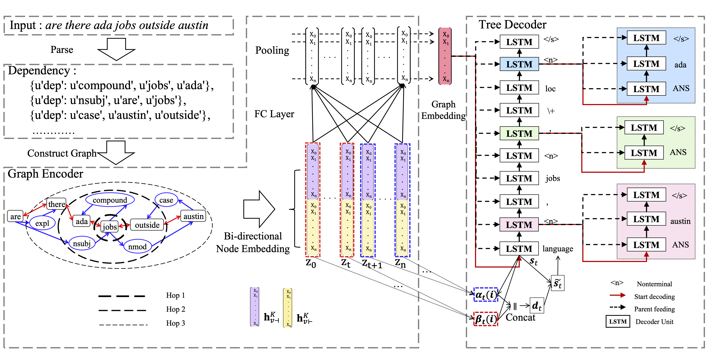
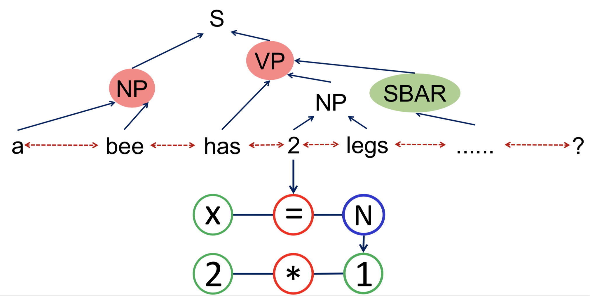

# Graph2Tree

Graph2Tree aims to automatically learn the mapping between structured input like graphs and output like trees. 
This example code is for our EMNLP'20 paper "Graph-to-Tree Neural Networks for Learning Structured Input-Output Translation with Applications to Semantic Parsing and Math Word Problem". You can access our paper via this link: https://arxiv.org/abs/2004.13781. 

This model can effectively solve two problems: Semantic Parsing  (SP) and Math Word Problem automatically solving (MWP). Actually, they both deal with the translation problem from original word sequence inputs (which can be augmented to be a syntactic graph) to tree outputs (the logic forms in SP and mathmatical expression in MWP are both hierarchical). 

When we employ our general Graph2Tree model in these two problems, by encoding both word order features and auxiliary structure features in our graph encoder, and decode the hierarchical outputs in a tree decoder, our Graph2Tree model achieve higher performance than baselines.

In this repo, we evaluate this model in **Math Word Problem (MWP)** auto-solving.

## An Overview to Graph2Tree

## Simple Introduction for MWP
Math Word Problem (MWP) solver aims to automatically generate  equations according to natural language problem descriptions. We evaluated our Graph2Tree model in MWP benchmark dataset [MAWPS](https://www.aclweb.org/anthology/N16-1136). A plain sample is shown below.

| Problem Description | Output Equation |
|-|-|
| 0.5 of the cows are grazing grass . 0.75 of the remaining are sleeping and 9 cows are drinking water from the pond . find the total number of cows . | ( ( 0.5 * x ) + ( 0.75 * ( 0.5 * x ) ) ) + 9.0 = x |

As shown in the picture below, to apply our Graph2Tree model. We firstly construct graph input from problem description by syntactic parsing (CoreNLP) and then represent the output equation with a hierarchical structure.

## GetStarted

- Intall required python packages
  
  > pytorch==1.0.0  
  > numpy==1.15.4  
  > networkx==2.2  
  > tqdm==4.28.1  

- Download [GloVe](http://nlp.stanford.edu/data/glove.6B.zip). For this task, We use the "glove.6B.300d.txt" pretrained embedding.
<!-- - Start the Stanford CoreNLP server and then run *data/GraphConstruction/constituency.ipynb* for Graph Generation. -->
- To save your time, we have completed parsing with Stanford CoreNLP for you, and parsing results can be read from ``data/GraphConstruction/file_for_parsing.pkl``  

## Data

Our graph data are organized in a dictionary form where meaning of different key-value mappings are as follows:

- *g_ids*: a mapping from the node ID to its ID in the graph
- *g_id_features*: a mapping from the node ID to its text features
- *g_adj*: a mapping from the node ID to its adjacent nodes (represented as thier IDs)

## Train
> sh train.sh

## Test
> sh test.sh

## Environment:

* OS:Ubuntu 16.04.4 LTS  
* Gcc version: 5.4.0 20160609 (Ubuntu 5.4.0-6ubuntu1~16.04.10)  
* GPU: TITAN Xp
* CUDA: 8.0 

## Reference

If you found this repo useful, please consider citing our paper:

Shucheng Li, Lingfei Wu, Shiwei Feng, Fangli Xu, Fengyuan Xu and Sheng Zhong, **"Graph-to-Tree Neural Networks for Learning Structured Input-Output Translation with Applications to Semantic Parsing and Math Word Problem."** In *Proceedings of the 2020 Conference on Empirical Methods in Natural Language Processing.*

	@article{li2020graph,
	  title={Graph-to-Tree Neural Networks for Learning Structured Input-Output Translation with Applications to Semantic Parsing and Math Word Problem},
	  author={Li, Shucheng and Wu, Lingfei and Feng, Shiwei and Xu, Fangli and Xu, Fengyuan and Zhong, Sheng},
	  journal={EMNLP},
	  year={2020}
	}
